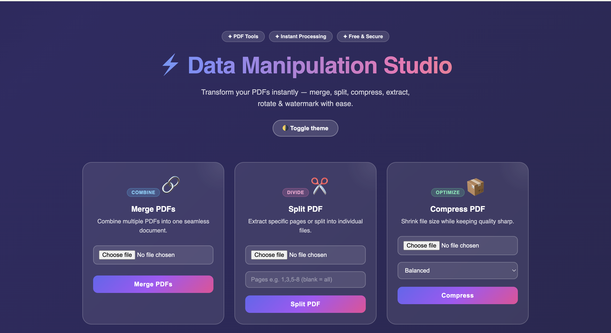
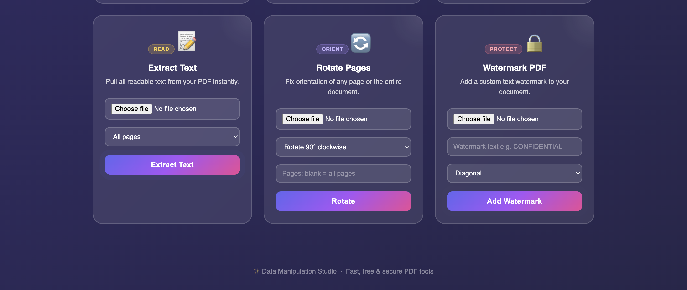
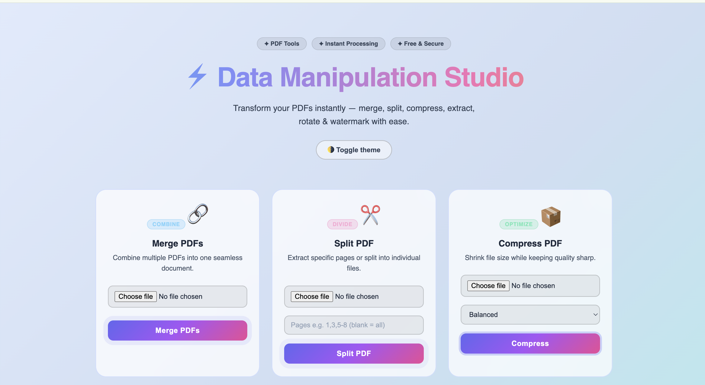
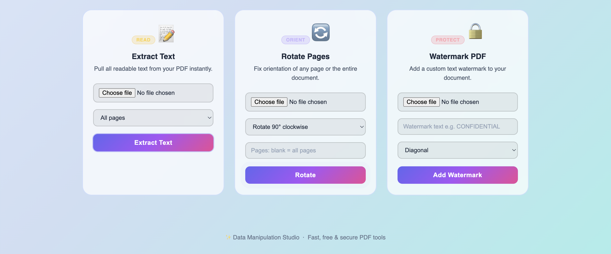

# ⚡ Data Manipulation Studio

A web-based PDF tool to merge, split, compress, rotate, watermark, and extract text from PDFs instantly.

## 🌐 Live Demo
https://data-manipulation-studio.onrender.com/

---

## ✨ Features

- 🔗 Merge multiple PDFs into one
- ✂️ Split PDF into pages
- 📦 Compress PDF files
- 📝 Extract text from PDFs
- 🔄 Rotate PDF pages
- 🔒 Add watermark to PDF
- 🌗 Light / Dark theme
- ⚡ Fast and simple UI

---

## 🛠 Tech Stack

**Frontend**
- HTML
- CSS
- JavaScript

**Backend**
- Python
- Flask

**Libraries**
- PyPDF2
- pikepdf
- reportlab

**Deployment**
- Render
- Gunicorn

---

## 📸 Screenshots

### Dark Theme




### Light Theme




---

## 🚀 Run Locally

Clone the repo

```
git clone https://github.com/anushka0917/data-manipulation-studio.git
```

Go inside folder

```
cd data-manipulation-studio
```

Install dependencies

```
pip install -r requirements.txt
```

Run the app

```
python app.py
```

Open in browser

```
http://127.0.0.1:5000
```

---

## 👩‍💻 Author

**Anushka Verma Namdeo**  
B.Tech Computer Science Engineering  

---

⭐ If you like this project, give it a star!